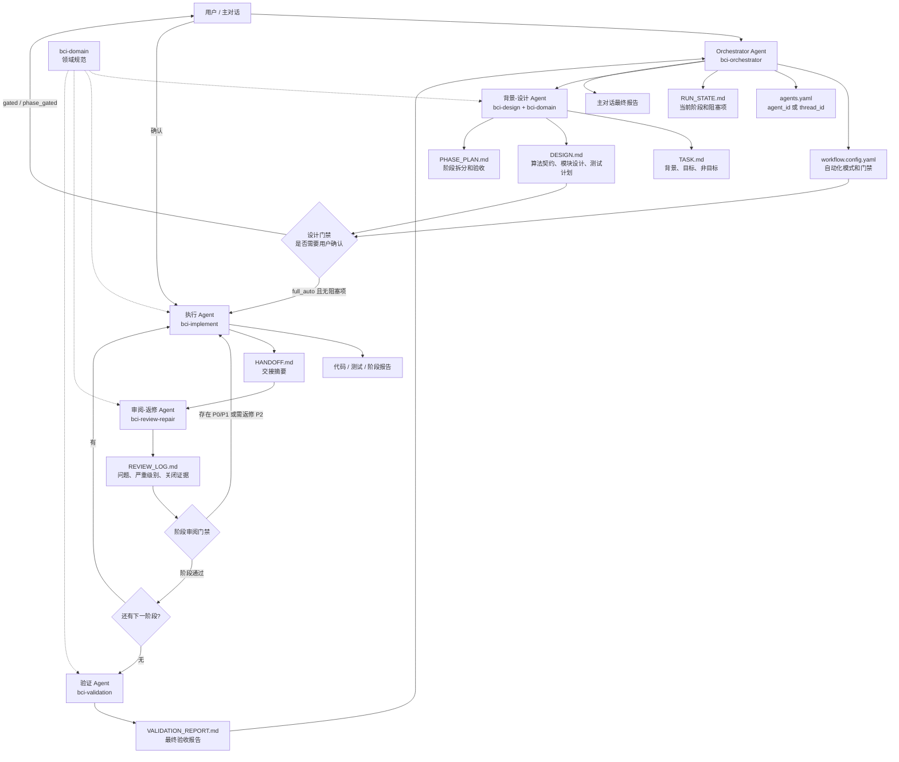
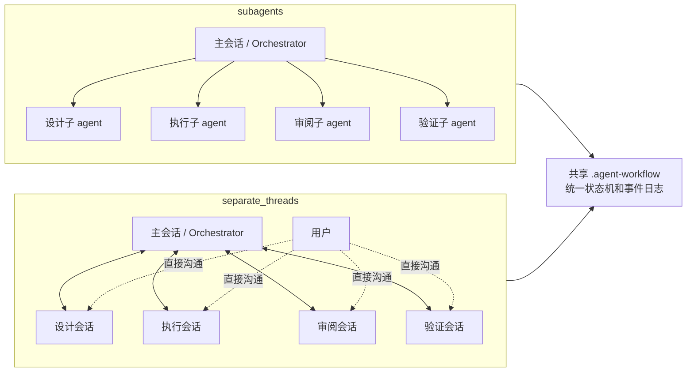
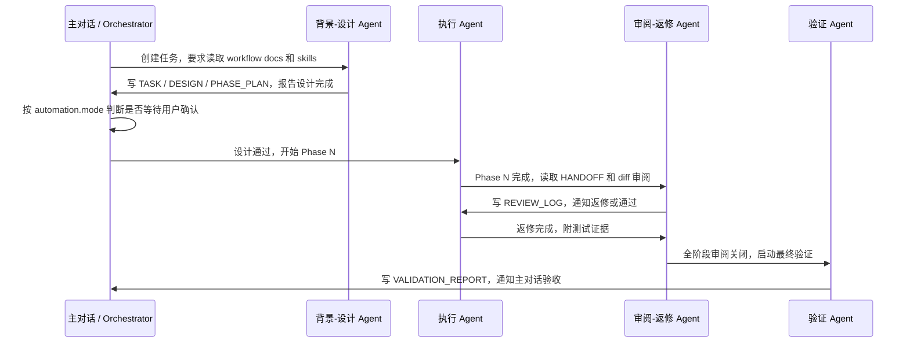

# BCI 多 Agent 算法研发流程架构

## 设计目标

| 目标 | 说明 |
|---|---|
| 稳定复用 | 同一套流程适用于 EEG、EMG、EOG、IMU 和混合信号算法任务 |
| 可恢复 | agent 失败、重启或替换后，通过共享文档继续工作 |
| 可审计 | 设计、执行、审阅、返修、验证都有文件留痕 |
| 可控自动化 | 默认用户确认后执行，也允许显式切换到全自动 |
| 工程质量 | 用阶段门禁约束算法契约、模块设计、测试证据和性能边界 |

## 总体架构图



## 核心分层

| 层级 | 名称 | 作用 | 长期复用 |
|---|---|---|---|
| L0 | `AGENTS.md` 项目规范层 | 所有 agent 默认遵守的项目规则 | 是 |
| L1 | BCI skills 层 | 固化角色 SOP 和领域规范 | 是 |
| L2 | `.agent-workflow/` 任务档案层 | 保存本轮任务事实、状态、证据 | 每任务一套 |
| L3 | Agent 执行层 | 根据拓扑使用内部子 agent 或独立角色会话 | 每任务临时 |
| L4 | 代码 / 测试 / 数据层 | 真实算法实现和验证资产 | 项目资产 |

## 两种执行拓扑

自动化模式控制“何时需要用户确认”，执行拓扑控制“角色运行在哪里”。两者互相独立，例如 `gated + separate_threads` 或 `full_auto + subagents` 都合法。

| 维度 | `subagents` | `separate_threads` |
|---|---|---|
| 角色载体 | 主会话内部子 agent | 每个角色一个独立 Codex 会话 |
| 标识 | `agent_id`、`canonical_name` | `thread_id`、`host_id` |
| 用户交互 | 通过主会话定向转发 | 可直接进入角色会话聊天 |
| UI | 主会话右侧子智能体面板 | Codex 左侧独立任务列表 |
| 工作目录 | 与主会话共享 | 必须使用同一个本地 checkout |
| 并发控制 | 主会话天然调度 | 强制单写者，审阅和验证只读 |
| 适用 | 集中调度、减少任务数量 | 长期角色讨论、用户频繁介入角色工作 |



## 为什么共享文档是核心

| 设计项 | 原因 |
|---|---|
| agent 消息只做通知 | 消息适合唤醒下一角色，不适合做长期事实源 |
| 共享文档保存事实 | 需求、设计、审阅、验证必须可恢复、可审计 |
| 阶段门禁控制推进 | 防止执行 agent 在设计未确认或 review 未关闭时继续扩散修改 |
| skills 保存角色规则 | agent 是临时执行体，skill 是稳定复用的岗位说明书 |
| Adapter 隔离拓扑差异 | 状态机只依赖角色和事件，不依赖 agent_id 或 thread_id 的具体投递方式 |

## 事件协议

所有角色事件都追加到 `EVENT_LOG.md`。相邻角色可以直接通知，但只有主会话可以更新状态并授权下一角色执行。

```text
角色写入产物
  -> 追加 EVENT_LOG
  -> 通知主会话
  -> 主会话验证门禁
  -> 主会话更新 RUN_STATE
  -> 主会话唤醒下一角色
```

## 通信拓扑



## 自动化模式

| 模式 | 默认用户参与 | 推荐场景 |
|---|---|---|
| `gated` | 设计完成后确认，最终验收确认 | 新算法、新接口、需求不完全明确 |
| `phase_gated` | 每阶段门禁建议确认 | 高风险、多阶段、影响面较大 |
| `full_auto` | 无阻塞项自动推进 | 需求清晰、已有契约、改动小 |

即使是 `full_auto`，以下情况也必须停下：采样率或窗口长度会改变算法语义、输出标签不清楚、涉及医学诊断承诺、需要新增生产依赖、需要破坏性文件操作、P0/P1 多轮无法关闭、测试无法真实运行、实现与设计冲突。
